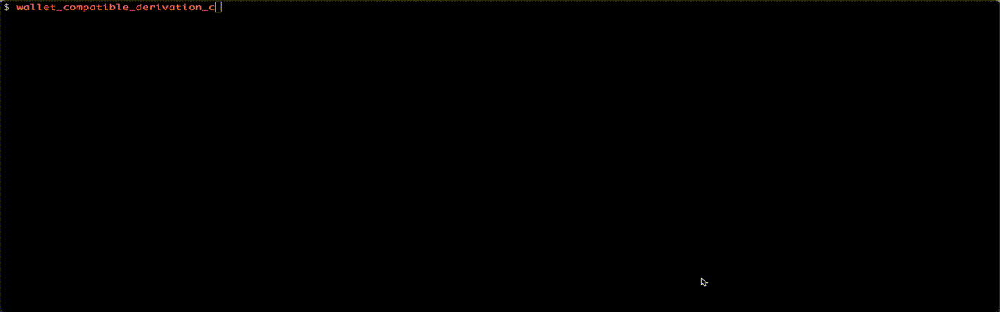

# Wallet Compatible Derivation

This repo is a package containing two crates - a library named `wallet_compatible_derivation` and binary named `wallet_compatible_derivation_cli`.

> [!IMPORTANT]  
> You are responsible for retaining sole possession and ownership of, and for securing
> the mnemonics (seed phrase(s)) you use with this software.
>
> You are responsible for reading the Security and License sections of this README respectively to understand the risks of using this software.

This software created Radix Babylon account address from hierarchical deterministic key pairs, derived using wallet compatible derivation paths which are compatible with the [Radix Wallet][wallet] available on iOS and Android. This means that the same (KeyPair, Address) tuples, contiguously, will be created by this software and the Radix Wallet software, for any given (Mnemonic, BIP-39 Passphrase, NetworkID) triple as input. Or in other words, given Mnemonic `M` and no BIP-39 passphrase, if the Radix Wallet will create account `A, B, C` at indices `0`, `1` and `2`, so will this software.

In order to stay compatible with the Radix Wallet, this software requires 24 words mnemonics, and to be fully compatible, do not use any BIP-39 passphrase (use an empty string).

The cryptographic curve used is [Curve25519][curve] (again, just like the Radix Wallet), and derivation scheme is [SLIP-10][slip10] - and extension of [BIP-32][b32] made to support other curves than "the Bitcoin curve". The derivation path scheme is inspired by [BIP-44][b44], but is more advanced (see [`AccountPath`][account_path] for details), and is built for maximum key isolation, for security.

Address derivation is using [Radix-Engine-Toolkit][ret].

Make sure to read the Security section below for security details.

## `wallet_compatible_derivation` library

Here is a short example of how to use the library:

```rust
extern crate wallet_compatible_derivation;
use wallet_compatible_derivation::prelude::*;

// Create an hierarchical deterministic derivation path.
let path = AccountPath::new(
	&NetworkID::Mainnet, // Mainnet or Stokenet (testnet)
	0 // Account Index, 0 is first.
);

// 24 word BIP-39 English mnemonic
let mnemonic: Mnemonic24Words = "bright club bacon dinner achieve pull grid save ramp cereal blush woman humble limb repeat video sudden possible story mask neutral prize goose mandate".parse().unwrap();

// Derive Babylon Radix account...
let account = Account::derive(
	&mnemonic, 
	"radix", // BIP-39 passphrase (can be empty string)
	&path
);

// ... containing the Account Address
assert_eq!(account.address, "account_rdx12yy8n09a0w907vrjyj4hws2yptrm3rdjv84l9sr24e3w7pk7nuxst8");

// ... and its private key, public key, ....
assert_eq!(account.private_key.to_hex(), "cf52dbc7bb2663223e99fb31799281b813b939440a372d0aa92eb5f5b8516003");

// continue with next index, `1` to derive next account
let path_of_next_account = AccountPath::new(
	&NetworkID::Mainnet,
	1 // `1` comes after `0` (breaking news!)
);
let second_account = Account::derive(
	&mnemonic, 
	"radix",
	&path_of_next_account
);
// Next address...
assert_eq!(second_account.address, "account_rdx129a9wuey40lducsf6yu232zmzk5kscpvnl6fv472r0ja39f3hced69");

```

## `wallet_compatible_derivation_cli` binary

`wallet_compatible_derivation_cli` is a CLI tool (binary) for derivation of keys and account addresses from a Mnemonic ("Seed Phrase"), optional BIP-39 passphrase, network id and an account index.

The `wallet_compatible_derivation_cli` binary uses the `wallet_compatible_derivation` library.

The CLI tool can be run in two different modes:
* Run without "pager", where the arguments are provided directly, like the `cat` command. Whilst convenient, this mode is ☣️ particularly UNSAFE ☣️, because sensitives inputs such as the mnemonic, and outputs such as the private keys, are stored in your shell history. We advise against using this mode for mnemonics protecting assets.
* Run with "pager", where the arguments are passed through a prompt, and outputs shown inside the application, like `less`. This is the default mode, and although inputs/outputs are not stored in the shell history, be warned that sensitive details may still live in memory of the terminal/application.


### pager

The `pager` mode is the preferred mode of `wallet_compatible_derivation_cli` binary since history is not stored in plaintext, it is an interactive tool asking for input while being run (similar to `gh auth login`), instead of passing input using arguments, therefore the input will not be part of your shell history. The output of the binary is shown in a pager, just like `less` and when the pager is quit, the output is not part of your shell history. Be warned that sensitive details may still live in the memory of the terminal/application.

```sh
wallet_compatible_derivation_cli pager --include-private-key
```

Since `pager` is the default mode, you can omit it, and just run:

```sh
wallet_compatible_derivation_cli --include-private-key
```

The `--include-private-key` is optional, and when specified the output will display the private keys of each derived account. Since you are running in `pager`, those private keys are not part of your shell history.

#### Demo


### no-pager

> [!IMPORTANT]  
> In this mode, your mnemonic and your derived keys will be present in your shell's command history and output.
> ONLY use this for mnemonics and accounts you really do not care about.

```sh
wallet_compatible_derivation_cli --include-private-key no-pager \
--mnemonic  "zoo zoo zoo zoo zoo zoo zoo zoo zoo zoo zoo zoo zoo zoo zoo zoo zoo zoo zoo zoo zoo zoo zoo vote" \
--passphrase "secret" \
--network "mainnet" \
--start 100 \
--count 7
```

Omit `--include-private-key` if you don't want to print out the private keys of the derived accounts.

#### Help

```sh
wallet_compatible_derivation_cli no-pager --help
```

## Installation

Easiest way to install the `wallet_compatible_derivation_cli` binary is to [install Rust][get_rust], and run this one liner:

```sh
cargo install --git https://github.com/radixdlt/wallet-compatible-derivation
```

# Security

> [!IMPORTANT]  
> Beware of key-loggers or spyware running on your machine! This software does not protect against any key-logging malware your computer might be infected with.
>
> Even in `pager` mode, you are asked to type in your mnemonic and if your computer is infected by a key-logger malware you might lose all your funds.
> In either mode, spyware may be able to read secrets out of the memory of the terminal application.

Future iterations of this software might implement an interactive "picker" of characters/words in randomized order to allow safe input of your mnemonic, but there is no planned release date for such a few feature.

All sensitive types of the `wallet_compatible_derivation` library implement the traits
`ZeroizeOnDrop` and `Zeroize` part of [the `zeroize` crate](https://docs.rs/zeroize/1.7.0/zeroize/) meaning that the secrets are "zeroed out"/wiped when dropped, ensuring that those secrets are not kept around in memory. 

The `wallet_compatible_derivation_cli` explicitly zeroize the mnemonic you input and all private keys, derivation paths and account addresses it derives. See for example the [`main` function here][cli_main].

> [!IMPORTANT]  
> Use of `Zeroize` on secrets inside this library cannot ensure the secrets are wiped from other applications on your machine. Calling applications or terminals may keep their own copies of the input/output in memory, or they may be on your clipboard or in shell history if you use `no-pager` mode.

# License

```
Copyright 2023 Radix Publishing Limited

Permission is hereby granted, free of charge, to any person obtaining a copy of this software and associated documentation files (the "Software"), to deal in the Software for non-production informational and educational purposes without restriction, including without limitation the rights to use, copy, modify, merge, publish, distribute, sublicense, and to permit persons to whom the Software is furnished to do so, subject to the following conditions:

This notice shall be included in all copies or substantial portions of the Software.

THE SOFTWARE HAS BEEN CREATED AND IS PROVIDED FOR NON-PRODUCTION, INFORMATIONAL AND EDUCATIONAL PURPOSES ONLY. 

THE SOFTWARE IS PROVIDED "AS IS", WITHOUT WARRANTY OF ANY KIND, EXPRESS OR IMPLIED, INCLUDING BUT NOT LIMITED TO THE WARRANTIES OF MERCHANTABILITY, FITNESS FOR A PARTICULAR PURPOSE, ERROR-FREE PERFORMANCE AND NONINFRINGEMENT. IN NO EVENT SHALL THE AUTHORS OR COPYRIGHT HOLDERS BE LIABLE FOR ANY CLAIM, DAMAGES, COSTS OR OTHER LIABILITY OF ANY NATURE WHATSOEVER, WHETHER IN AN ACTION OF CONTRACT, TORT OR OTHERWISE, ARISING FROM, OUT OF OR IN CONNECTION WITH THE SOFTWARE OR THE USE, MISUSE OR OTHER DEALINGS IN THE SOFTWARE. THE AUTHORS SHALL OWE NO DUTY OF CARE OR FIDUCIARY DUTIES TO USERS OF THE SOFTWARE. 
```

[wallet]: https://wallet.radixdlt.com/
[curve]: https://en.wikipedia.org/wiki/Curve25519
[slip10]: https://github.com/satoshilabs/slips/blob/master/slip-0010.md
[account_path]: crates/wallet_compatible_derivation/src/account_path.rs
[cli_main]: crates/wallet_compatible_derivation_cli/src/main.rs
[b32]: https://github.com/bitcoin/bips/blob/master/bip-0032.mediawiki
[b44]: https://github.com/bitcoin/bips/blob/master/bip-0044.mediawiki
[get_rust]: https://www.rust-lang.org/tools/install